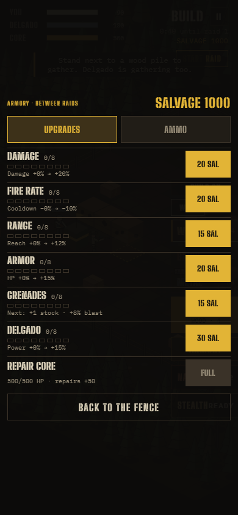
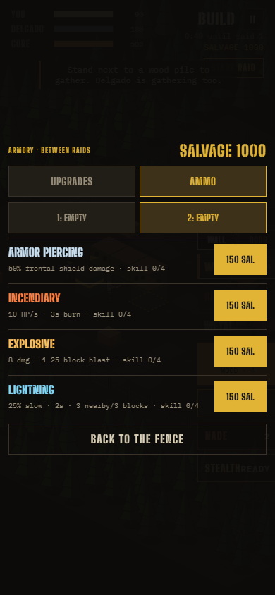
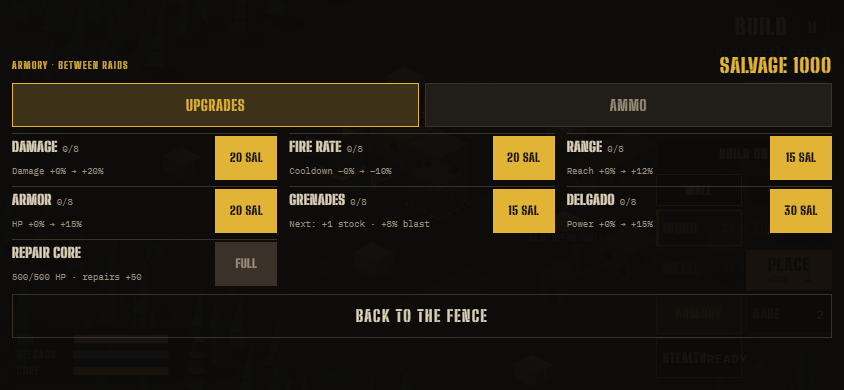
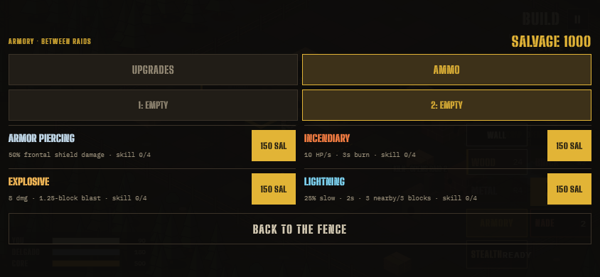

# Compact Armory UI

October 1, 2026 follow-up to the ammo/Armory expansion, included in **v0.9.5.2**. Big U asked for a mobile Armory that fits without scrolling. This replaces the earlier stacked, scrolling layout. The release rebuilds the frontend and service worker; final deployment verification is recorded in the parent evidence directory.

## Changes

- Two categories: **UPGRADES** and **AMMO**, each fitting one viewport.
- Upgrade rows show level out of eight, price and the current-to-next stat benefit. Shorter phones use the numeric level in place of the extra pip row.
- The Ammo tab shows four choices once. Sniper chooses slot 1 or 2 using two buttons that also show each equipped type; it no longer duplicates the four-choice list for each slot.
- Ammo rows retain effect values, skill rank, equipped/other-slot state and the correct 150/75 salvage price. Full descriptions are included in accessible button labels.
- Removed the long introduction, put salvage in the header, and kept the close button visible. Landscape uses three columns for upgrades and two for ammo. Desktop uses two columns.
- Tabs, slot selectors, purchase buttons and close button have at least 44×44 CSS pixel touch targets. Padding respects safe-area insets. Controller opens on an actionable row; its triggers use the existing tab navigation.

## Validation

`armory_layout` passes **73 layout cases** across 320×480, 320×568, 360×640, 390×844, 430×932, 568×320, 667×375, 740×360, 844×390 and 1280×800. Cases include normal and Sniper jobs, both categories, Sniper slot 2, maxed skills/upgrades, equipped slots, purchases, Base Battle and a synthetic FFA disabled-state render (FFA does not offer a playable Armory).

For every case, the entire card stays inside the viewport, overlay content does not exceed its client height or width, touch targets are at least 44×44, and descriptions/button text do not overflow horizontally. Tests also buy ammo into both Sniper slots, reject a duplicate, switch for 75 salvage, buy an ordinary upgrade, and preserve the equipped display while switching tabs.

| Sniper view | Card top–bottom | Overlay content / viewport height |
| --- | --- | --- |
| 320×480 upgrades | 8.5–471.5 | 480 / 480 |
| 320×480 ammo | 57–423 | 480 / 480 |
| 568×320 upgrades | 17.5–302.5 | 320 / 320 |
| 568×320 ammo | 19–301 | 320 / 320 |
| 390×844 upgrades | 155–689 | 844 / 844 |
| 390×844 ammo | 199.5–644.5 | 844 / 844 |
| 844×390 upgrades | 52.5–337.5 | 390 / 390 |
| 844×390 ammo | 46–344 | 390 / 390 |

`ammo_armory`, `ammo_network`, `controller`, `v087` and `csp` also pass. The network test buys the Sniper's second slot through the actual new tab/slot controls on a guest. Build and `git diff --check` pass. Screenshots at portrait, landscape and desktop sizes were visually inspected. These are Chrome viewport checks; a physical-device pass was not performed.

## Captures

### Portrait

### Landscape

Full measurements are in `armory_layout.json`; focused logs and desktop screenshots are saved beside this report. Gameplay, prices, skill gates and protocol are unchanged by this UI follow-up.
