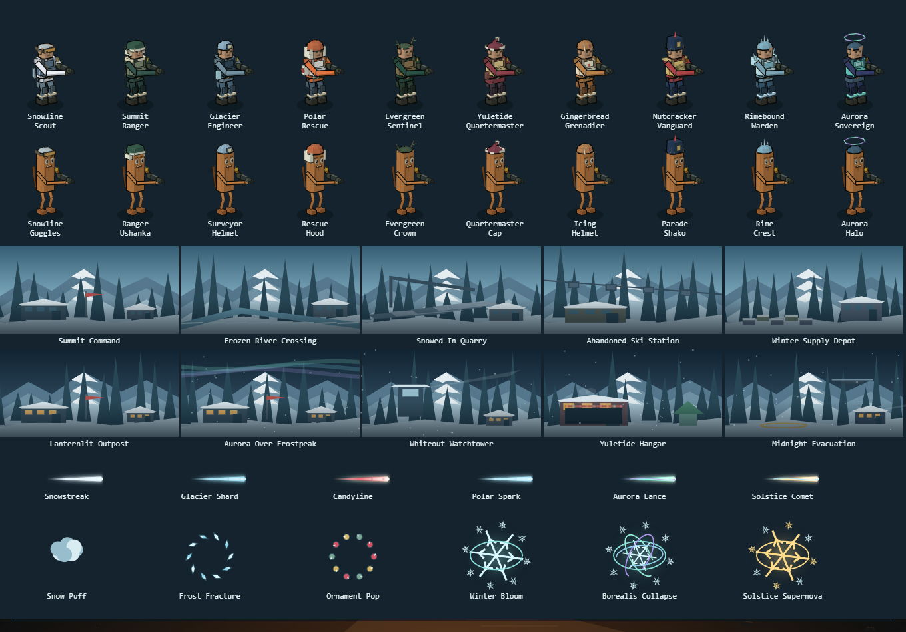

# Winter cosmetic catalog

Exactly **42 items**: 10 skins, 10 hats, 10 backgrounds, six tracers and six kill effects. Four backgrounds animate; exactly two tracers and two kill effects are Gold. Eight skins are milestone rewards and the other 34 items come from the **14-shard Winter Case**.

Rarity weights: Common 45%, Rare 32%, Epic 16%, Legendary 6%, Gold 1%. These are rarity weights, not per-item probabilities. Items within the rolled rarity use the existing case picker and duplicate shard rules.

The first character row shows matching skin/hat pairs; the second shows the same headgear on Sahur. The remaining rows preview all ten backgrounds, six tracers and six kill effects. Registration and descriptions match the applied server catalog.

## Skins

| ID | Item | Rarity | Acquisition | Motion | Description |
| --- | --- | --- | --- | --- | --- |
| `skin:snowline` | Snowline Scout | Rare | 250 Frostpeak stages held | Static art; standard character poses | White insulated scout jacket, wrapped boots and climbing straps. |
| `skin:summitranger` | Summit Ranger | Epic | 500 Frostpeak stages held | Static art; standard character poses | Deep green mountain kit, rope harness and reinforced shoulders. |
| `skin:glacierengineer` | Glacier Engineer | Legendary | 1,000 Frostpeak stages held | Static art; standard character poses | Blue-gray utility suit, repair tools and frost-marked plates. |
| `skin:polarrescue` | Polar Rescue | Rare | 25 Rime defeats | Static art; standard character poses | Rescue-orange parka, reflective trim and medical packs. |
| `skin:evergreen` | Evergreen Sentinel | Epic | 50 Rime defeats | Static art; standard character poses | Layered green armor with pine details and bark-toned straps. |
| `skin:yuletideqm` | Yuletide Quartermaster | Rare | Winter Case | Static art; standard character poses | Burgundy supply coat with brass hardware and field pouches. |
| `skin:gingergren` | Gingerbread Grenadier | Epic | Winter Case | Static art; standard character poses | Biscuit-toned combat plates with inset icing seams and candy accents. |
| `skin:nutcracker` | Nutcracker Vanguard | Legendary | 100 Rime defeats | Static art; standard character poses | Red and navy parade armor with sculpted plates and brass fasteners. |
| `skin:rimewarden` | Rimebound Warden | Gold | 250 Rime defeats | Static art; standard character poses | Angular expedition armor with fractured ice plates and luminous frost edges. |
| `skin:aurorasovereign` | Aurora Sovereign | Gold | 2,500 Frostpeak stages held | Static art; standard character poses | Premium polar armor with aurora trim and a luminous chest crest. |

## Matching headgear

| ID | Item | Rarity | Acquisition | Motion | Description |
| --- | --- | --- | --- | --- | --- |
| `hat:snowgoggles` | Snowline Goggles | Common | Winter Case | Static | Amber snow lenses in a compact insulated frame. |
| `hat:ushanka` | Ranger Ushanka | Rare | Winter Case | Static | Fur-lined field cap with folded winter ear flaps. |
| `hat:surveyhelm` | Surveyor Helmet | Rare | Winter Case | Static | Angular survey helmet with a bright expedition lamp. |
| `hat:rescuehood` | Rescue Hood | Epic | Winter Case | Static | Structured orange storm hood with a pale insulated face opening. |
| `hat:pinecrown` | Evergreen Crown | Epic | Winter Case | Static | A branching evergreen crown with restrained pine accents. |
| `hat:yulecap` | Quartermaster Cap | Common | Winter Case | Static | Fitted burgundy seasonal cap with a pale winter cuff. |
| `hat:icinghelm` | Icing Helmet | Common | Winter Case | Static | Shaped biscuit helmet edged in pale icing. |
| `hat:shako` | Parade Shako | Legendary | Winter Case | Static | Tall red military shako with brass parade trim. |
| `hat:rimecrest` | Rime Crest | Legendary | Winter Case | Static | A jagged translucent ice crest on an expedition helmet. |
| `hat:aurorahalo` | Aurora Halo | Gold | Winter Case | Animated halo | A segmented aurora halo with gentle motion; still with reduced motion. |

## Backgrounds

| ID | Item | Rarity | Acquisition | Motion | Description |
| --- | --- | --- | --- | --- | --- |
| `bg:summitcommand` | Summit Command | Common | Winter Case | Static | A snowy summit outpost above three mountain ridges. |
| `bg:frozenriver` | Frozen River Crossing | Rare | Winter Case | Static | An icy supply crossing with branching river cracks. |
| `bg:snowquarry` | Snowed-In Quarry | Rare | Winter Case | Static | Snow-covered quarry terraces and an abandoned crane. |
| `bg:skistation` | Abandoned Ski Station | Epic | Winter Case | Static | A deserted cable lift suspended above snowy pines. |
| `bg:winterdepot` | Winter Supply Depot | Common | Winter Case | Static | Expedition supply crates beside a sheltered mountain depot. |
| `bg:lanternoutpost` | Lanternlit Outpost | Epic | Winter Case | Static | A warm lanternlit outpost in the winter dusk. |
| `bg:aurorafrostpeak` | Aurora Over Frostpeak | Legendary | Winter Case | Animated | Aurora ribbons and sparse drifting snow over Frostpeak. |
| `bg:whiteouttower` | Whiteout Watchtower | Epic | Winter Case | Animated | Wind-driven snow and a slow watchtower beacon. |
| `bg:yulehangar` | Yuletide Hangar | Legendary | Winter Case | Animated | Warm seasonal hangar lights and gentle steam. |
| `bg:midnightevac` | Midnight Evacuation | Gold | Winter Case | Animated | A midnight landing pad, sweeping searchlights and a distant helicopter. |

## Tracers

| ID | Item | Rarity | Acquisition | Motion | Description |
| --- | --- | --- | --- | --- | --- |
| `trail:snowstreak` | Snowstreak | Rare | Winter Case | Shot effect | Fine white rounds with sparse snowflake motes. |
| `trail:glaciershard` | Glacier Shard | Rare | Winter Case | Shot effect | Translucent blue ice fragments along a short trail. |
| `trail:candyline` | Candyline | Epic | Winter Case | Shot effect | A restrained red-and-white candy spiral. |
| `trail:polarspark` | Polar Spark | Legendary | Winter Case | Shot effect | Cool sparks with a crystalline tail. |
| `trail:auroralance` | Aurora Lance | Gold | Winter Case | Shot effect | Layered mint and violet aurora ribbon with an icy core. |
| `trail:solsticecomet` | Solstice Comet | Gold | Winter Case | Shot effect | Warm gold core, winter-star accents and a crisp frost wake. |

## Kill effects

| ID | Item | Rarity | Acquisition | Motion | Description |
| --- | --- | --- | --- | --- | --- |
| `fx:snowpuff` | Snow Puff | Rare | Winter Case | Kill animation | A compact snow burst that fades quickly. |
| `fx:frostfracture` | Frost Fracture | Rare | Winter Case | Kill animation | Small ice crystals break into readable blue shards. |
| `fx:ornamentpop` | Ornament Pop | Epic | Winter Case | Kill animation | A brief seasonal ornament burst with restrained fragments. |
| `fx:winterbloom` | Winter Bloom | Legendary | Winter Case | Kill animation | An expanding snowflake and a ring of frost petals. |
| `fx:borealiscollapse` | Borealis Collapse | Gold | Winter Case | Kill animation | Aurora orbits collapse into a crystalline ring. |
| `fx:solsticenova` | Solstice Supernova | Gold | Winter Case | Kill animation | A gold-white winter starburst, ice halo and trailing snow stars. |

## Rendering and ownership

- Hats can be equipped separately from their matching skins. The ten hats are added to Sahur’s supported-headgear list and use the same wardrobe renderer in gameplay, previews, thumbnails and workers.
- Background motion freezes under reduced-motion settings; the Aurora Halo also respects the shared motion setting. Static background painters do not change with time.
- Tracers and kill effects are visual only. They cannot apply damage, slow, hitboxes, target changes or poisoned frost. Gold effects use bounded aurora/ice/star construction and shared preview/gameplay painters.
- Verified 1,280 poses: ten winter pairs and ten Sahur/hat pairs × four classes × eight angles × standing/downed. [Pose/count evidence](winter_cosmetics.json) records the fit and animation checks.
- Actual eligible map/boss progress unlocks eight skins through the existing account helper. All other IDs use the server Winter Case pool; no client-supplied ownership or unlock balance is accepted.

See [BALANCE.md](BALANCE.md) for thresholds and expected progression, and [the release report](README.md) for protocol, backend state, budgets and limitations.
